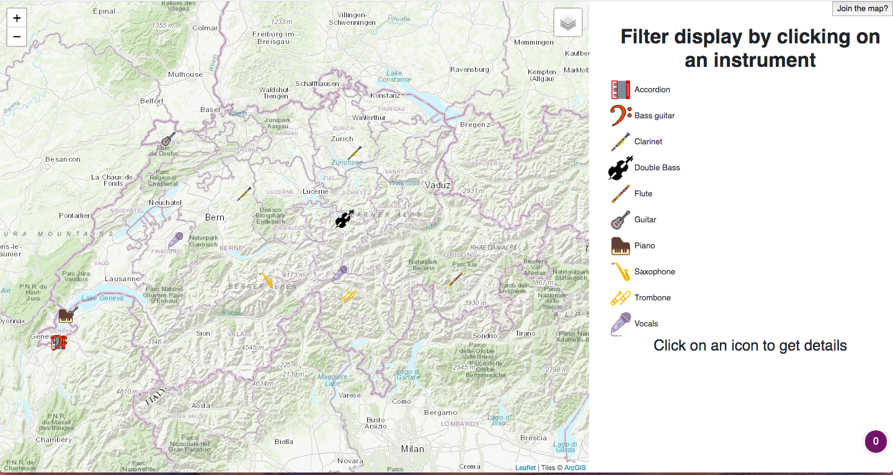

# Projet de Geovisualisation 2 - Musical talent map
This web application allows musicians to place their information on a map.

In order to run this application you must have python3. Since it is in a developping stage, one must copy the database structure that is linked to the application.
The structure and all the required tables are found in the `dump.sql` file. Data to fill them up can be found within the `data` folder; a `.txt` file for each table.
Once the database is set up, one must modify ine 5 in `app.py` with the local computers' information (databasename, user, password).

To see the data in json format, visit `localhost:0000/musicians.json`. Another route was set for statistics regarding the data at `localhost:0000/stats.json`.

There was an attempt for `postgis`implementation but it wasn't succesful... yet as shown inside `stats.sql`.

On start this is what you will see.

When the top right button is clicked ('Join the map?') is takes you to this form

The icons can be filtered by clicking on the intrument icons. Information about the musicians is displayed when the icons on the map are clicked.
